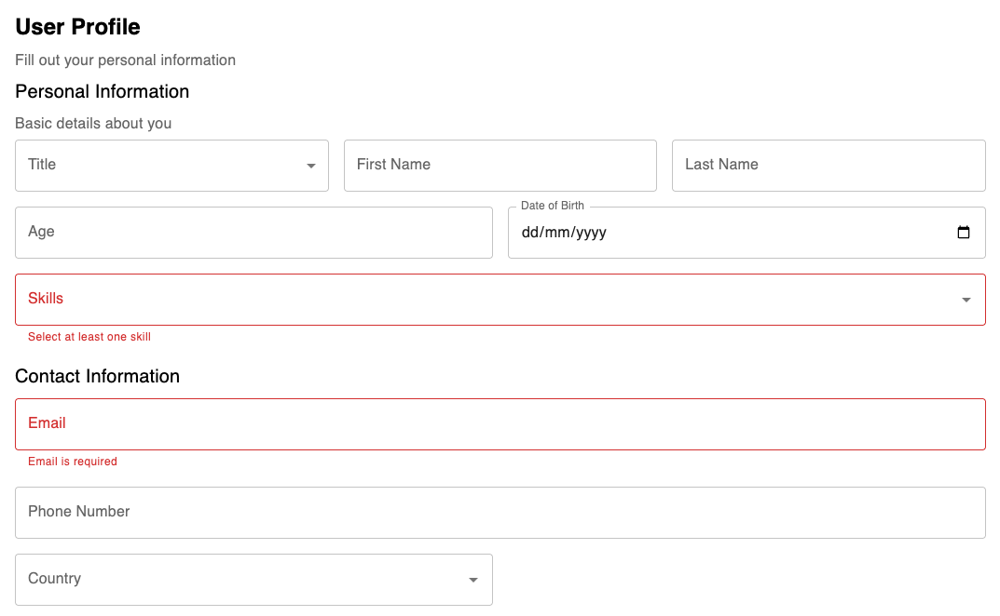

# React Form DTO


**Schema-first, DTO-driven form framework for React and Material UI (MUI v7)**

React Form DTO is a **high-level form framework** for building complex, dynamic, and enterprise-scale forms using declarative JSON or TypeScript DTOs—rather than verbose, repetitive JSX.

It is designed for **schema-driven UIs**, backend-configured workflows, admin panels, and internal tools where forms must be **configurable, scalable, and predictable**.

---

## Why React Form DTO?

Most form libraries solve **state management**.  
React Form DTO solves **form architecture**.

It operates at a higher abstraction level where **layout, validation, rendering, and behavior** are defined in a single schema.

### Use this library when:

- Forms are generated from backend schemas or configuration APIs
- UI logic must be reused across multiple applications
- Forms are large, dynamic, or conditional
- You need imperative control (wizards, modals, async flows)
- Your design system is based on Material UI

### Key Advantages

- 📄 **DTO-first design** – define forms entirely in JSON or TypeScript
- 🎨 **Material UI v7 native** – accessibility and consistency by default
- 🧱 **Composable structure** – Form → Section → Field
- 🎯 **Imperative API** – programmatic control via refs
- 🔀 **Conditional rendering** – dynamic visibility and logic
- 🧩 **Extensible renderers** – plug in custom components
- 🛡️ **Strong TypeScript typing** – safe, predictable APIs
- 🚀 **Enterprise-ready** – optimized for large, config-driven forms
- 🔎 **Nested condition engine** – combine AND/OR groups for powerful, multi‑field visibility rules

---

## How It Compares

| Feature | React Form DTO | React Hook Form | Formik |
|------|---------------|----------------|--------|
| Schema / DTO driven | ✅ Native | ❌ Manual | ❌ Manual |
| MUI-first | ✅ Yes | ⚠️ Partial | ⚠️ Partial |
| Imperative API | ✅ First-class | ⚠️ Limited | ⚠️ Limited |
| Large dynamic forms | ✅ Excellent | ⚠️ Medium | ❌ Poor |
| Boilerplate | ✅ Minimal | ❌ High | ❌ High |

> **Note:** React Form DTO is **not a replacement** for React Hook Form.  
> It is a **higher-level abstraction** for schema-driven UI generation.

---

## What This Library Is Not

- ❌ A low-level form state library
- ❌ A visual form builder
- ❌ A replacement for small hand-crafted forms
- ❌ A design system

React Form DTO excels when **forms are data, not components**.

---

## Documentation & Demo

- 📘 **Documentation:** See full DTO reference, APIs, and advanced examples [Documentation](https://shakir-afridi.github.io/react-form-dto/docs)
- 📗 **Storybook:** Interactive component playground and live demos [Live Demo](https://shakir-afridi.github.io/react-form-dto/storybook)

---

## Installation

```bash
npm install react-form-dto
# or
yarn add react-form-dto
# or
pnpm add react-form-dto
```

### Requirements

- Node.js >= 18
- React >= 19
- Material UI >= 7

---

## Release Notes

See [CHANGELOG.md](./.github/CHANGELOG.md) for detailed version history.

---

## Core Concepts

### DTO as Source of Truth

All structure, layout, validation, and behavior live in a single schema.

### Stateless Rendering

The UI is derived entirely from the DTO and internal state.

### Imperative Escape Hatch

Refs enable workflows that declarative-only approaches struggle with.

### Renderer Isolation

Field logic is decoupled from presentation, enabling customization.

## Quick Start

```tsx
import { FormBuilder, type FormBuilderHandle } from 'react-form-dto';
import { useRef } from 'react';
import { myFormDTO } from './myFormDTO';

const formRef = useRef<FormBuilderHandle>(null);

const handleSubmit = (e) => {
  e.preventDefault();
  if (!formRef.current) return;
  const values = formRef.current.getValues();
  const errors = formRef.current.validateAll();
  formRef.current.handleChange?.("firstName", "NewName");
  const firstNameErrors = formRef.current.validateField("firstName");
  const allErrors = formRef.current.getErrors();
};

return (
  <form onSubmit={handleSubmit}>
    <FormBuilder ref={formRef} dto={myFormDTO} />
    <button type="submit">Submit</button>
  </form>
);
```

---

## 📋 Example Form rendered



The form in the image above is generated from this DTO.

```tsx
const profileForm: FormDTO = {
    title: "User Profile",
    description: "Fill out your personal information",
    layout: { cols: 12, gap: "1rem" }, // global form layout
    sections: [
        {
            id: "personal",
            heading: "Personal Information",
            description: "Basic details about you",
            layout: { cols: 12, gap: "1rem" }, // section layout
            fields: [
                {
                    id: "title",
                    type: "select",
                    label: "Title",
                    placeholder: "Select your title",
                    options: ["Mr", "Ms", "Dr", "Prof"],
                    layout: { cols: 4 },
                },
                {
                    id: "firstName",
                    type: "text",
                    label: "First Name",
                    layout: { cols: 4 },
                },
                {
                    id: "lastName",
                    type: "text",
                    label: "Last Name",
                    layout: { cols: 4 },
                },
                {
                    id: "age",
                    type: "number",
                    label: "Age",
                    layout: { cols: 6 },
                },
                {
                    id: "dob",
                    type: "date",
                    label: "Date of Birth",
                    layout: { cols: 6 },
                },
                {
                    id: "skills",
                    type: "multi-autocomplete",
                    label: "Skills",
                    placeholder: "Select your skills",
                    options: [
                        "React",
                        "TypeScript",
                        "Node.js",
                        "GraphQL",
                        "Docker",
                    ],
                    layout: { cols: 12 },
                    validations: {
                        required: "Select at least one skill",
                        validate: (val: string[]) =>
                            val && val.length < 2
                                ? "Pick at least 2 skills"
                                : null,
                    },
                },
            ],
        },
        {
            id: "contact",
            heading: "Contact Information",
            layout: { cols: 12 },
            fields: [
                {
                    id: "email",
                    type: "email",
                    label: "Email",
                    validations: {
                        required: "Email is required",
                        pattern: /^[^\s@]+@[^\s@]+\.[^\s@]+$/,
                    },
                },
                { id: "phone", type: "text", label: "Phone Number" },
                {
                    id: "country",
                    type: "autocomplete",
                    label: "Country",
                    placeholder: "Select a country",
                    options: ["Pakistan", "India", "USA", "UK", "Germany"],
                    layout: { cols: 6 },
                },
            ],
        },
    ],
};
```

---

## Supported Field Types

### Text Inputs

- `text`
- `number`
- `date`
- `email`
- `password`
- `textarea`

### Selection Inputs

- `select`
- `autocomplete`
- `multi-autocomplete`
- `radio`

### Boolean Inputs

- `checkbox`

---

## 🎭 Conditional Visibility with `visibleWhen`

React Form DTO supports dynamic field visibility based on the values of other fields in the form. This is achieved through the `visibleWhen` property, which allows you to define simple conditions or complex logical expressions.

### Basic Usage

Show a field only when another field has a specific value:

```tsx
{
  id: "partnerName",
  type: "text",
  label: "Partner Name",
  visibleWhen: {
    field: "maritalStatus",
    equals: "married"
  }
}
```

For detail docuemtation, please visit [Docs](https://shakir-afridi.github.io/react-form-dto/docs/api/visibleWhen.html)

---

## 🌍 Internationalization (I18n)

React Form DTO has built-in support for multi-language forms through `I18String` and `I18nOption` types.

### Using I18String

Any text property (`label`, `placeholder`, `title`, `description`, validation messages) can be either a plain string or a locale map:

```tsx
// Simple string (single language)
{
  label: "First Name"
}

// Multi-language support
{
  label: {
    en: "First Name",
    fr: "Prénom",
    es: "Nombre",
    de: "Vorname"
  }
}
```

### Using I18nOption for Selections

For select, autocomplete, and multi-autocomplete fields, you can use `I18nOption` objects to provide translatable labels while maintaining stable values:

```tsx
{
  id: "country",
  type: "select",
  label: { en: "Country", fr: "Pays" },
  options: [
    {
      value: "us",
      label: { en: "United States", fr: "États-Unis" }
    },
    {
      value: "fr",
      label: { en: "France", fr: "France" }
    },
    {
      value: "de",
      label: { en: "Germany", fr: "Allemagne" }
    }
  ]
}
```

**Backward Compatibility:** Simple string arrays still work:

```tsx
options: ["USA", "France", "Germany"] // Still supported
```

### I18n Validation Messages

Validation messages also support I18n:

```tsx
validations: {
  required: {
    en: "This field is required",
    fr: "Ce champ est obligatoire",
    es: "Este campo es obligatorio"
  },
  validate: (value) => value.length < 2 
    ? { 
        en: "Minimum 2 characters",
        fr: "Minimum 2 caractères" 
      }
    : null
}
```

### Complete I18n Example

```tsx
const multilingualForm: FormDTO = {
  title: {
    en: "User Registration",
    fr: "Inscription de l'utilisateur",
    es: "Registro de Usuario"
  },
  description: {
    en: "Please fill in your details",
    fr: "Veuillez remplir vos coordonnées",
    es: "Por favor complete sus datos"
  },
  sections: [
    {
      id: "personal",
      heading: {
        en: "Personal Information",
        fr: "Informations personnelles",
        es: "Información Personal"
      },
      fields: [
        {
          id: "title",
          type: "select",
          label: { en: "Title", fr: "Titre", es: "Título" },
          options: [
            { value: "mr", label: { en: "Mr", fr: "M.", es: "Sr." } },
            { value: "ms", label: { en: "Ms", fr: "Mme", es: "Sra." } },
            { value: "dr", label: { en: "Dr", fr: "Dr", es: "Dr." } }
          ]
        },
        {
          id: "firstName",
          type: "text",
          label: { en: "First Name", fr: "Prénom", es: "Nombre" },
          placeholder: { 
            en: "Enter your first name",
            fr: "Entrez votre prénom",
            es: "Ingrese su nombre"
          },
          validations: {
            required: {
              en: "First name is required",
              fr: "Le prénom est obligatoire",
              es: "El nombre es obligatorio"
            }
          }
        }
      ]
    }
  ]
};
```

> **Note:** The library provides the I18n structure. You'll need to implement locale selection and text resolution in your application layer.

---

## Custom Field Renderers

Override any default renderer by supplying your own component:

```ts
{
  id: "salary",
  type: "number",
  label: "Salary",
  renderer: CurrencyInput
}
```

This makes the library extensible without modifying core logic.

---

## Validation API

Validation is handled through the `useFormBuilder` hook and the imperative form handle.

```ts
const {
  handleChange,   // Function to update a field value: (id, value) => void
  validateAll,    // Function to validate all fields: () => Record<string, string[]>
  getValues,      // Function to get all current form values: () => Record<string, any>
  getErrors,      // Function to get all current form errors: () => Record<string, string | null>
  validateField,  // Function to validate a specific field: (id) => string[]
} = useFormBuilder(myFormDTO);
```

### Validation Rules

```ts
validations: {
  required: "This field is required",
  validate: (value) => value.length < 2 ? "Minimum 2 characters" : null
}
```

> Recommendation: Standardize validation return values to `string[]` for predictable handling in large applications.

---

## Real-World Enterprise Usage

```text
Backend → returns FormDTO
Frontend → renders form dynamically
Backend updates → UI changes without redeploy
```

This enables:

- Backend-driven workflows
- Feature flags via schemas
- Faster iteration without frontend releases

---

## Other Use Cases

- Admin dashboards
- Internal enterprise tools
- Multi-step onboarding flows
- Config-driven forms from APIs
- Rapid UI scaffolding for MUI projects

---

## Performance Characteristics

- Independent field rendering
- Section-level isolation
- Optimized for 100+ field forms
- No unnecessary re-renders across sections

---

## Incremental Adoption Strategy

- Use React Form DTO for large dynamic forms
- Keep React Hook Form for small custom forms
- Share validation logic between both

---

## Roadmap (Suggested)

- Field registry API (`registerFieldType`)
- Async validation support
- Form-level conditional logic
- Schema import (JSON Schema / OpenAPI)

---

## 🤝 Contributing

Contributions are welcome and encouraged.

1. Fork the repository
2. Create a feature branch
   `git checkout -b feature/my-feature`
3. Commit your changes
   `git commit -m "Add my feature"`
4. Push to the branch
   `git push origin feature/my-feature`
5. Open a Pull Request

Please keep changes focused and well-documented.

---

## 📜 License

MIT

---

**React Form DTO — Schema-first forms for Material UI**