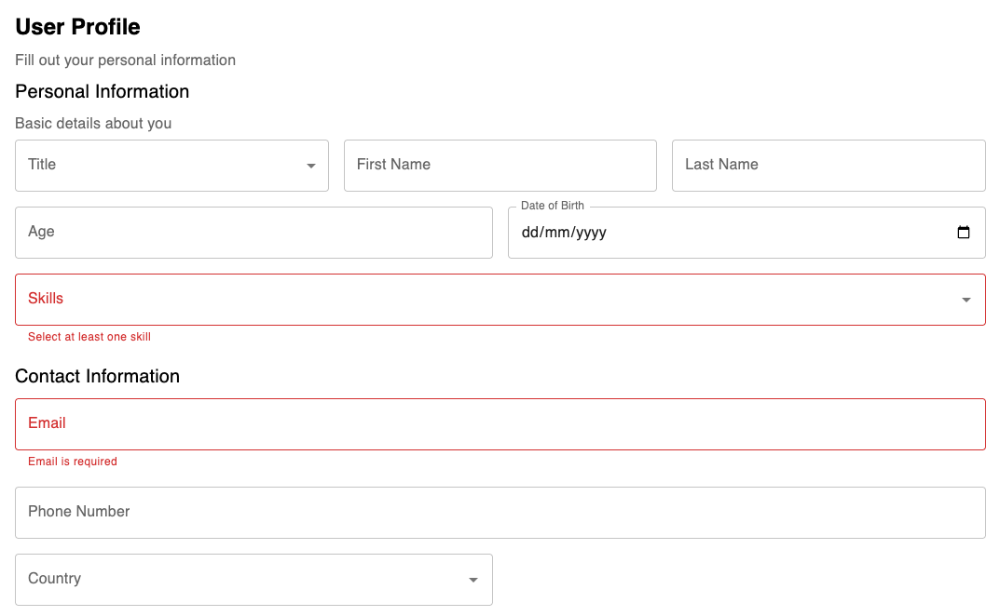

# React Form DTO


**Schema-first, DTO-driven form framework for React and Material UI (MUI v7)**

React Form DTO is a **high-level form framework** for building complex, dynamic, and enterprise-scale forms using declarative JSON or TypeScript DTOs—rather than verbose, repetitive JSX.

It is designed for **schema-driven UIs**, backend-configured workflows, admin panels, and internal tools where forms must be **configurable, scalable, and predictable**.

---

## Why React Form DTO?

Most form libraries solve **state management**.  
React Form DTO solves **form architecture**.

It operates at a higher abstraction level where **layout, validation, rendering, and behavior** are defined in a single schema — with a react-hook-form–style hook API to manage state and submission.

### Use this library when:

- Forms are generated from backend schemas or configuration APIs
- UI logic must be reused across multiple applications
- Forms are large, dynamic, or conditional
- You need reactive watches, field arrays, or context-driven child components
- Your design system is based on Material UI

### Key Advantages

- 📄 **DTO-first design** – define forms entirely in JSON or TypeScript
- 🎨 **Material UI v7 native** – accessibility and consistency by default
- 🧱 **Composable structure** – Form → Section → Field
- 🪝 **Hook-based API** – `useFormDTO`, `useForm`, `useWatch`, `useFieldArray`, `useFormContext`
- 🔀 **Conditional rendering** – dynamic visibility and logic
- 🧩 **Extensible renderers** – plug in custom components
- 🛡️ **Strong TypeScript typing** – safe, predictable APIs
- 🚀 **Enterprise-ready** – optimized for large, config-driven forms
- 🔎 **Nested condition engine** – combine AND/OR groups for powerful, multi‑field visibility rules

---

## How It Compares

| Feature | React Form DTO | React Hook Form | Formik |
|------|---------------|----------------|--------|
| Schema / DTO driven | ✅ Native | ❌ Manual | ❌ Manual |
| MUI-first | ✅ Yes | ⚠️ Partial | ⚠️ Partial |
| Hook-based API | ✅ First-class | ✅ Yes | ⚠️ Partial |
| Large dynamic forms | ✅ Excellent | ⚠️ Medium | ❌ Poor |
| Boilerplate | ✅ Minimal | ❌ High | ❌ High |

> **Note:** React Form DTO is **not a replacement** for React Hook Form.  
> It is a **higher-level abstraction** for schema-driven UI generation, with a familiar hook API on top.

---

## What This Library Is Not

- ❌ A low-level form state library
- ❌ A visual form builder
- ❌ A replacement for small hand-crafted forms
- ❌ A design system

React Form DTO excels when **forms are data, not components**.

---

## Documentation & Demo

- 📘 **Documentation:** See full DTO reference, APIs, and advanced examples [Documentation](https://shakir-afridi.github.io/react-form-dto/docs)
- 📗 **Storybook:** Interactive component playground and live demos [Live Demo](https://shakir-afridi.github.io/react-form-dto/storybook)

---

## Installation

```bash
npm install react-form-dto
# or
yarn add react-form-dto
# or
pnpm add react-form-dto
```

### Requirements

- Node.js >= 18
- React >= 19
- Material UI >= 7

---

## Release Notes

See [CHANGELOG.md](./.github/CHANGELOG.md) for detailed version history.

---

## Core Concepts

### DTO as Source of Truth

All structure, layout, validation, and behavior live in a single schema object. Define it once — the library handles the rest.

### Hook-based State Management

`useFormDTO` bridges the schema into a react-hook-form–style context. Any component inside `<FormProvider>` can read values, watch fields, and access errors without prop-drilling.

### Renderer Isolation

Field logic is decoupled from presentation, enabling full customization via the `renderers` prop.

### Imperative Escape Hatch

A ref-based API (`FormBuilderHandle`) is available for scenarios that need programmatic control outside the React tree.

---

## Quick Start

### 1 — Define a FormDTO

```ts
import type { FormDTO } from 'react-form-dto';

const profileForm: FormDTO = {
  title: "User Profile",
  sections: [
    {
      id: "personal",
      heading: "Personal Information",
      fields: [
        {
          id: "firstName",
          type: "text",
          label: "First Name",
          layout: { cols: 6 },
          validations: { required: "First name is required" },
        },
        {
          id: "lastName",
          type: "text",
          label: "Last Name",
          layout: { cols: 6 },
          validations: { required: "Last name is required" },
        },
        {
          id: "email",
          type: "email",
          label: "Email",
          validations: {
            required: "Email is required",
            pattern: /^[^\s@]+@[^\s@]+\.[^\s@]+$/,
          },
        },
      ],
    },
  ],
};
```

### 2 — Render with FormProvider

Pass the DTO to `useFormDTO`, wrap in `<FormProvider>`, and render with `<FormBuilder>`. `form.handleSubmit` validates all fields before calling your callback.

```tsx
import { FormBuilder, FormProvider, useFormDTO } from 'react-form-dto';
import { profileForm } from './profileForm';

export function ProfilePage() {
  const form = useFormDTO(profileForm);

  const onSubmit = (data: Record<string, any>) => {
    console.log('Submitted:', data);
  };

  return (
    <FormProvider value={form}>
      <form onSubmit={form.handleSubmit(onSubmit)}>
        <FormBuilder dto={profileForm} />
        <button type="submit">Submit</button>
      </form>
    </FormProvider>
  );
}
```

`useFormDTO` automatically extracts default values and wires all `validations` rules from the DTO into the form context. Errors appear after a field is touched — not on initial load.

### 3 — Read state from child components

Any component inside `<FormProvider>` can subscribe to form state:

```tsx
import { useWatch, useFormContext } from 'react-form-dto';

function LiveGreeting() {
  const firstName = useWatch('firstName');
  return <p>Hello, {firstName || 'stranger'}!</p>;
}

function SubmitButton() {
  const { errors } = useFormContext();
  const hasErrors = Object.values(errors).some(Boolean);
  return <button type="submit" disabled={hasErrors}>Submit</button>;
}
```

---

## Hooks

| Hook | Description |
|------|-------------|
| `useFormDTO(dto, options?)` | Creates a form instance bound to a `FormDTO`. Extracts defaults and wires all validations automatically. |
| `useForm(options?)` | Lower-level hook for plain (non-DTO) forms with a react-hook-form–style API. |
| `useFormContext()` | Reads the form instance from the nearest `<FormProvider>`. Throws if no provider found. |
| `useOptionalFormContext()` | Like `useFormContext` but returns `undefined` instead of throwing. |
| `useWatch(name)` | Reactively reads one or more field values. Re-renders on change. |
| `useFieldArray({ name })` | Manages an array field — `fields`, `append`, `prepend`, `remove`, `swap`, `insert`. |
| `useFormBuilderController(props)` | Wraps `FormBuilder` in a ref-based controller. Returns a `Form` component + imperative API. |
| `useFormBuilder(dto)` | Low-level hook that manages raw form state without a provider. |

---

## Validation

Validation rules live on each field's `validations` object and are run automatically by `handleSubmit` or on demand via `trigger()`.

```ts
{
  id: "email",
  type: "email",
  label: "Email",
  validations: {
    required: "Email is required",
    pattern: /^[^\s@]+@[^\s@]+\.[^\s@]+$/,
    minLength: 5,
    maxLength: 100,
  },
}
```

### Built-in rules

| Rule | Type | Description |
|------|------|-------------|
| `required` | `boolean \| string` | Field must not be empty. |
| `minLength` | `number` | Minimum string length. |
| `maxLength` | `number` | Maximum string length. |
| `min` | `number` | Minimum numeric value. |
| `max` | `number` | Maximum numeric value. |
| `pattern` | `RegExp` | Must match regex. |
| `validate` | `(value, allValues) => string \| null` | Custom function. |

### Validate programmatically

```ts
const isValid = form.trigger();         // validate all fields
const emailOk = form.trigger('email');  // validate one field
```

### Inject server errors

```ts
const onSubmit = async (data) => {
  try {
    await api.save(data);
  } catch {
    form.setError('email', 'This email is already taken');
  }
};
```

---

## useFormBuilderController — Quick drop-in

For cases where you want the full form rendered from a DTO with an external imperative API and no `FormProvider` setup:

```tsx
import { useFormBuilderController } from 'react-form-dto';
import { profileForm } from './profileForm';

function MyForm() {
  const ctrl = useFormBuilderController({ dto: profileForm, locale: 'en' });

  const handleSubmit = (e: React.FormEvent) => {
    e.preventDefault();
    const errors = ctrl.validateAll();
    if (Object.values(errors).every((e) => !e?.length)) {
      console.log(ctrl.getValues());
    }
  };

  return (
    <form onSubmit={handleSubmit}>
      <ctrl.Form />
      <button type="submit">Submit</button>
    </form>
  );
}
```

| Method | Returns | Description |
|--------|---------|-------------|
| `getValues()` | `Record<string, any>` | All current field values. |
| `getErrors()` | `Record<string, string \| null>` | Current error state. |
| `validateAll()` | `Record<string, string[]>` | Validates every field. |
| `validateField(id)` | `string[]` | Validates one field. |
| `handleChange(id, val)` | `void` | Programmatically set a field value. |
| `Form` | `() => JSX.Element` | Auto-rendered form component. |

---

## 📋 Example Form rendered



The form in the image above is generated from this DTO:

```tsx
const profileForm: FormDTO = {
    title: "User Profile",
    description: "Fill out your personal information",
    layout: { cols: 12, gap: "1rem" },
    sections: [
        {
            id: "personal",
            heading: "Personal Information",
            description: "Basic details about you",
            layout: { cols: 12, gap: "1rem" },
            fields: [
                {
                    id: "title",
                    type: "select",
                    label: "Title",
                    placeholder: "Select your title",
                    options: ["Mr", "Ms", "Dr", "Prof"],
                    layout: { cols: 4 },
                },
                {
                    id: "firstName",
                    type: "text",
                    label: "First Name",
                    layout: { cols: 4 },
                },
                {
                    id: "lastName",
                    type: "text",
                    label: "Last Name",
                    layout: { cols: 4 },
                },
                {
                    id: "age",
                    type: "number",
                    label: "Age",
                    layout: { cols: 6 },
                },
                {
                    id: "dob",
                    type: "date",
                    label: "Date of Birth",
                    layout: { cols: 6 },
                },
                {
                    id: "skills",
                    type: "multi-autocomplete",
                    label: "Skills",
                    placeholder: "Select your skills",
                    options: ["React", "TypeScript", "Node.js", "GraphQL", "Docker"],
                    layout: { cols: 12 },
                    validations: {
                        required: "Select at least one skill",
                        validate: (val: string[]) =>
                            val && val.length < 2 ? "Pick at least 2 skills" : null,
                    },
                },
            ],
        },
        {
            id: "contact",
            heading: "Contact Information",
            layout: { cols: 12 },
            fields: [
                {
                    id: "email",
                    type: "email",
                    label: "Email",
                    validations: {
                        required: "Email is required",
                        pattern: /^[^\s@]+@[^\s@]+\.[^\s@]+$/,
                    },
                },
                { id: "phone", type: "text", label: "Phone Number" },
                {
                    id: "country",
                    type: "autocomplete",
                    label: "Country",
                    placeholder: "Select a country",
                    options: ["Pakistan", "India", "USA", "UK", "Germany"],
                    layout: { cols: 6 },
                },
            ],
        },
    ],
};
```

---

## Supported Field Types

### Text Inputs

- `text`
- `number`
- `date`
- `email`
- `password`
- `textarea`

### Selection Inputs

- `select`
- `autocomplete`
- `multi-autocomplete`
- `radio`

### Boolean Inputs

- `checkbox`

---

## 🎭 Conditional Visibility with `visibleWhen`

React Form DTO supports dynamic field visibility based on the values of other fields. Define simple conditions or complex AND/OR groups:

```tsx
{
  id: "partnerName",
  type: "text",
  label: "Partner Name",
  visibleWhen: {
    field: "maritalStatus",
    equals: "married"
  }
}
```

For full documentation see [Docs → visibleWhen](https://shakir-afridi.github.io/react-form-dto/docs/api/visibleWhen.html).

---

## 🌍 Internationalization (I18n)

Any text property (`label`, `placeholder`, `title`, `description`, validation messages) can be a plain string or a locale map:

```tsx
{
  label: {
    en: "First Name",
    fr: "Prénom",
    de: "Vorname"
  },
  validations: {
    required: {
      en: "First name is required",
      fr: "Le prénom est obligatoire"
    }
  }
}
```

Pass `locale` to `useFormDTO` to resolve messages:

```ts
const form = useFormDTO(myDTO, { locale: 'fr' });
```

For select/autocomplete fields, use `I18nOption` objects for translatable option labels:

```tsx
options: [
  { value: "us", label: { en: "United States", fr: "États-Unis" } },
  { value: "de", label: { en: "Germany", fr: "Allemagne" } }
]
```

---

## Custom Field Renderers

Override any default renderer by supplying your own component via the `renderers` prop:

```tsx
<FormBuilder dto={myDTO} renderers={{ text: MyTextField, select: MySelect }} />
```

Or pass them through `useFormBuilderController`:

```ts
const ctrl = useFormBuilderController({ dto: myDTO, locale: 'en', renderers: { text: MyTextField } });
```

---

## Real-World Enterprise Usage

```text
Backend → returns FormDTO
Frontend → renders form dynamically
Backend updates → UI changes without redeploy
```

This enables:

- Backend-driven workflows
- Feature flags via schemas
- Faster iteration without frontend releases

---

## Other Use Cases

- Admin dashboards
- Internal enterprise tools
- Multi-step onboarding flows
- Config-driven forms from APIs
- Rapid UI scaffolding for MUI projects

---

## Performance Characteristics

- Independent field rendering
- Section-level isolation
- Optimized for 100+ field forms
- No unnecessary re-renders across sections

---

## Incremental Adoption Strategy

- Use React Form DTO for large dynamic forms
- Keep React Hook Form for small custom forms
- Share validation logic between both

---

## Roadmap (Suggested)

- Field registry API (`registerFieldType`)
- Async validation support
- Form-level conditional logic
- Schema import (JSON Schema / OpenAPI)

---

## 🤝 Contributing

Contributions are welcome and encouraged.

1. Fork the repository
2. Create a feature branch  
   `git checkout -b feature/my-feature`
3. Commit your changes  
   `git commit -m "Add my feature"`
4. Push to the branch  
   `git push origin feature/my-feature`
5. Open a Pull Request

Please keep changes focused and well-documented.

---

## 📜 License

MIT

---

## React Form DTO — Schema-first forms for Material UI
